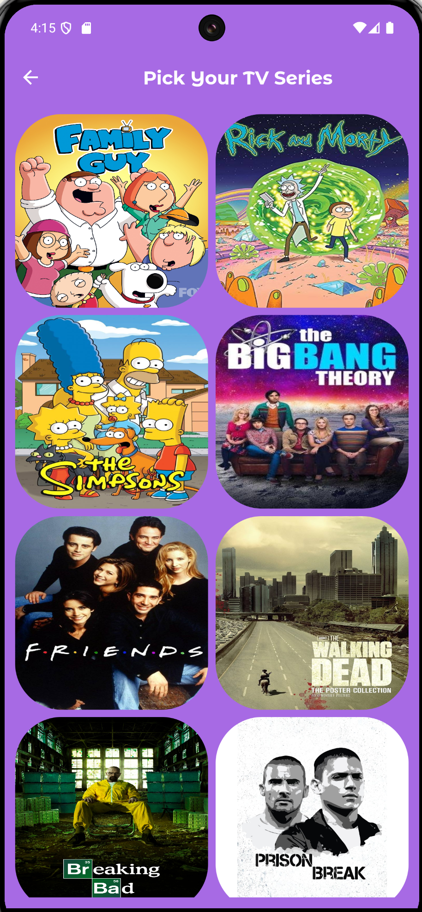
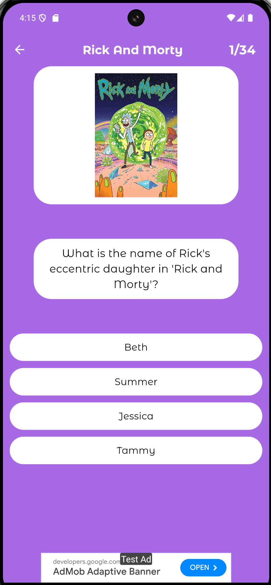
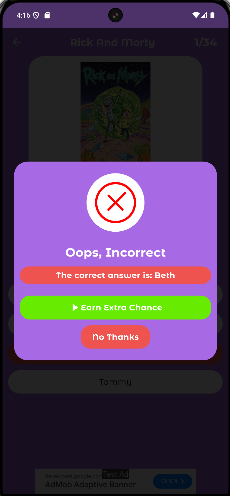

# Game Trivia Pro

Welcome to **Game Trivia Pro** – a fun and engaging trivia game designed for fans of series and movies! Test your knowledge and challenge yourself with a variety of questions about your favorite TV shows and films.


<div style="display: flex; justify-content: space-around;">
   
   
   
   
</div>

## Features

- **Exciting Trivia Questions**: Enjoy a wide range of questions related to popular series and movies.
- **Progressive Difficulty**: Correct answers lead to new questions, keeping the game challenging and engaging.
- **User-Friendly Interface**: Intuitive and easy-to-navigate interface for a smooth gaming experience.

## How to Play

1. **Start the Game**: Launch Game Trivia Pro and start answering trivia questions.
2. **Answer Questions**: Each question will test your knowledge about series and movies.
3. **Get a Correct Answer**: If you answer correctly, you’ll move on to the next question.
4. **Continue Playing**: Keep answering correctly to face new and more challenging questions.

## Installation

1. Clone the repository:
   ```bash
   git clone https://github.com/mgy-programmer/triviaprogame.git

2. Navigate into the project directory:
   ```bash
   cd triviaprogame

 ## License
Game Trivia Pro is licensed under the MIT License.

Contact
For any questions or feedback, feel free to reach out to us at contact@ayotechcorp.com

Enjoy playing and testing your trivia knowledge with Game Trivia Pro!
   

